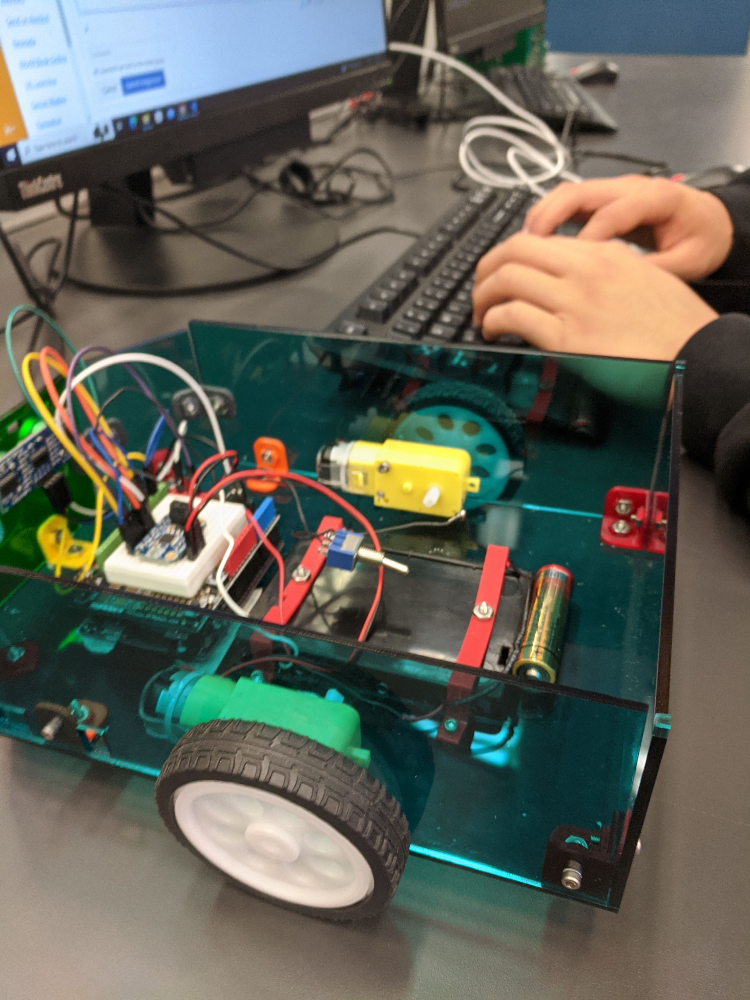
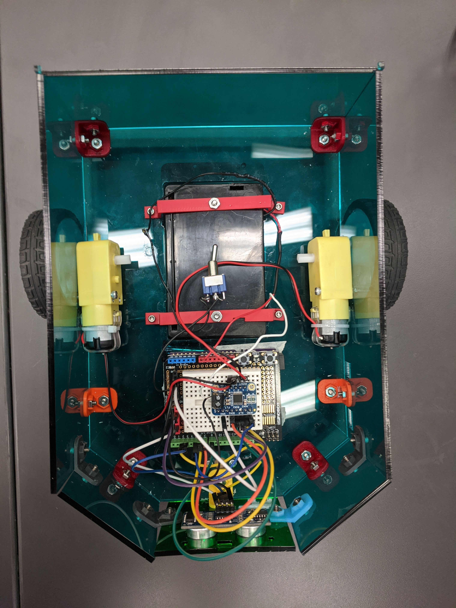

# Atticus' Virtual Nobebook
Welcome! this Repo has all of the brief and not so brief summaries of almost all of my projects I worked on in the last year (2022-2023.)

(If anything in the Repo does not work, here is a link to the VScode that was used to make it, it probably might come in handy later.)


https://vscode.dev/github/alauter30/CircuitPython-1/blob/225f634e369d3e240181a707ca6dc2b344732a83


# CircuitPython
This repository will actually serve as a aid to help you get started with your own template.  You should copy the raw form of this readme into your own, and use this template to write your own.  If you want to draw inspiration from other classmates, feel free to check [this directory of all students!](https://github.com/chssigma/Class_Accounts).
## Table of Contents
* [Table of Contents](#TableOfContents)
* [Hello_CircuitPython](#Hello_CircuitPython)
* [CircuitPython_Servo](#CircuitPython_Servo)
* [CircuitPython_LCD](#CircuitPython_LCD)
* [CAD](#CAD)
---

## Hello_CircuitPython

### Description & Code
Hello all! this is my long awaited descriptions on stuff I did nearly 5-6 months ago
I'll admit I am embarassingly late to the party, but at least it ain't june yet!

This is where I Learned how to write Engineering notebooks and the "Hello World!" stuff


Here's how you make code look like code:

```python
from time import sleep

while True:
    print("Hello world!")
    print("Hello world! Atticus rocks!")
    sleep(1)

```


### Evidence


And here is how you should give image credit to someone, if you use their work:

Image credit goes to [Rick A](https://www.youtube.com/watch?v=dQw4w9WgXcQ&scrlybrkr=8931d0bc)


### Wiring
Make an account with your google ID at [tinkercad.com](https://www.tinkercad.com/learn/circuits), and use "TinkerCad Circuits to make a wiring diagram."  It's really easy!  
Then post an image here.   [here's a quick tutorial for all markdown code, like making links](https://guides.github.com/features/mastering-markdown/)


### Reflection
I wish I would've gotten this WAY sooner, but here we are.

---
## This is the part when things get more original.

## CircuitPython_Servo

### Description 
Eons ago, back in september, I was working on a servo and what came out was a servo that moved.


# Evidence


## Wiring

## Reflection
This is pretty much a blur from a distant past, sadly I did not record this project in particular so I'm scrapping it back together.


# Me and Franklin's Paper Airplane arm

### Description & Code

```python
Code Is currently In the hands of my partner (WIP)

```

# Evidence


  

## Reflection
The Paper airplane arm took a while to model and I'm very proud of modling and building this, sadly it remains unfinished due to my partner not being here to share the code, I am looking foreward to finishing this in the near future.


## Description & Code
This is the current WIP that we're cooking up, while as I write this we are still waiting for Franklin's share of the Motor and Sensor code (Between you and me, if he does not come on monday, imma just do it for him.)

```python
This code is for when the Motor and sensor is introduced
from simple_pid import PID
pid = PID(1, 0.1, 0.05, setpoint=1)

# Assume we have a system we want to control in controlled_system
v = controlled_system.update(0)

while True:
    # Compute new output from the PID according to the systems current value
    control = pid(v)
    
    # Feed the PID output to the system and get its current value
    v = controlled_system.update(control)
Final Product
WIP - Not likely to finish.
```

### Evidence

### Wiring

### Reflection
This was an interesting project, we did run into a couple of rough edges in the production of this project, such as one of our teammates was gone, and I kinda wished I had a bigger, or at least a better role I was more experienced in. (I do not code well.)


# CAD
This involves some most of the CAD projects I've worked with this year
## Table of Contents
* [Onshape Collaboration](#onshape-collaboration) 
* [Swing Arm](#swing-arm)
* [Multi_Design_practice](#multidesignpractice)
* [Other Onshape Assemblies](#other-onshape-assemblies)
* [Onshape Certificaton](#onshape-certification)
* []

## Onshape Collaboration
---
### Description
In this project, we were supposed to create a sort of hand soap dispenser with Lucy and Ben, This project was split into 3 parts, The top (Ben), The pump (Lucy), and The base, (Me - Atticus).
### Link to cad
https://cvilleschools.onshape.com/documents/c6df38fcb6e024ff6b2fdb81/w/66e1f649a19cf6cca2247617/e/89b3856ab4908e77e9722429?renderMode=0&uiState=646f7a037dea8338f7dc976b
### Image

### Reflection
Onshape collab was a fun project, while trying to make a hand soap dispenser thingamajig, yet I'm not sure if there were more collab projects I didn't know about (Besides the Pull copter/"Teamwork makes the dream work" project.)
## Swing Arm
---
### Description
This was made for practice on the onshape collaboration test, this is not the original because It was deleted and made again for practice (So this one may not be entirely accurate to the original.)
### Link to cad
https://cvilleschools.onshape.com/documents/83844949e07ea31127ec3375/w/a2cb5f0c9848ad19b994d895/e/46b53c18c2c3f425d37c5040?renderMode=0&uiState=64760cefdc53a4085282cdb5
### Image

### Reflection
A quick and simple project, yet it had to be redone in the last week so again, it may not be entirely accurate to it's predecessor.
## Multi_Design_practice
---
### Description
This was one of the lessons to learn how to 3D model parts using the directions a blueprint.
### Link to cad
https://cvilleschools.onshape.com/documents/e7f6c5de8f18198dc8caa9fc/w/9f98bff0714563ce348f3dfb/e/4667124a416b1229cd35ddac?renderMode=0&uiState=646f78103bc4814150f6a50e
### Image

### Reflection
Went well, no complaints here.
## Other Onshape Assemblies
---


## Onshape Certification 
## Results; Fail
Unfortunately in the end, while a lot of the onshape models were well done (in my opinion), I was running out of time and had to guess a lot of the multiple choice questions - I hope to try to take the test again sometime.
